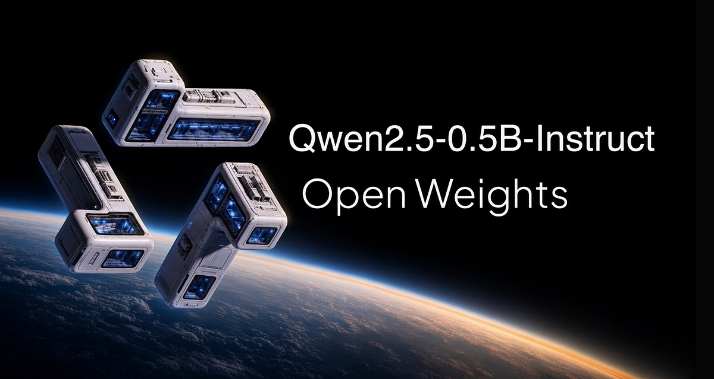

<p align="center">
  
</p>

# Least-Data SFT of Qwen2.5-0.5B-Instruct

<p align="center">
  <strong>Qwen2.5-0.5B-Instruct</strong> · open weights · Apache 2.0 · LoRA SFT · Colab T4<br/>
  Teach a 0.5B clerk a new ticket-card format with <strong>8 training examples</strong>
</p>

<p align="center">
  <a href="https://colab.research.google.com/github/cobusgreyling/qwen-05b-min-sft/blob/main/colab_qwen_05b_min_sft.ipynb"></a>
  <a href="https://huggingface.co/Qwen/Qwen2.5-0.5B-Instruct"></a>
  <a href="LICENSE"></a>
</p>

<p align="center">
  <a href="https://colab.research.google.com/github/cobusgreyling/qwen-05b-min-sft/blob/main/colab_qwen_05b_min_sft.ipynb">Open notebook</a> ·
  <a href="https://huggingface.co/Qwen/Qwen2.5-0.5B-Instruct">Model card</a> ·
  <a href="BLOG.md">Full write-up</a>
</p>

---

Stock [`Qwen/Qwen2.5-0.5B-Instruct`](https://huggingface.co/Qwen/Qwen2.5-0.5B-Instruct) is a polite chat model. Ask it to handle a duplicate charge and you get an apology and a request for more details.

This lab teaches it a **rigid five-field ticket card** a downstream system can parse — using **eight labeled examples**, completion-only LoRA, and a frozen before/after test.

A local run of the same recipe (40 LoRA steps on the 8 cards):

| | Stock 0.5B | After 8-card LoRA |
|--|------------|-------------------|
| `<<TICKET>>` tags | 0 / 6 | **6 / 6** |
| `task_pass` | **0%** | **67%** (4 / 6) |

**Keywords:** Qwen2.5-0.5B-Instruct, open weights, least-data SFT, LoRA, TRL, PEFT, Colab T4, completion-only loss, supervised fine-tuning

---

## What this notebook is

[`colab_qwen_05b_min_sft.ipynb`](colab_qwen_05b_min_sft.ipynb) is a self-contained Colab lab. You do not need to clone the Python package to learn the idea. Run all cells on a **free T4** (~5–10 minutes including the model download).

It answers one question: **how little labeled data does it take to change a small open-weight instruct model?**

Answer we actually ran: **8 training cards.** 40 LoRA steps. Frozen test the trainer never saw: format **0% → 100%** tagged cards, task **0% → 67%**.

The intended path is the notebook. The `src/` scripts are the same recipe, runnable locally.

---

## 60-second start (Colab — recommended)

1. **[Open `colab_qwen_05b_min_sft.ipynb` in Colab](https://colab.research.google.com/github/cobusgreyling/qwen-05b-min-sft/blob/main/colab_qwen_05b_min_sft.ipynb)**
2. **Runtime → Change runtime type → GPU → T4**
3. **Runtime → Run all**

If the GitHub badge 404s in a fork, upload the `.ipynb` in Colab (**File → Upload notebook**) and pick a T4.

---

## What the notebook does

```
write 8 / 4 / 6 cards
     → show the mask on the real Qwen tokenizer
     → score stock 0.5B on the frozen test     # BEFORE
     → LoRA SFT for 40 steps (completion_only_loss=True)
     → score the adapter on the same 6 tickets # AFTER
     → print the table + side-by-side
     → optional: type a new ticket
```

| Cell | What you learn |
|------|----------------|
| **0–1** | Runtime + install (`transformers`, `trl`, `peft`) |
| **2** | The 8 / 4 / 6 DeskCard dataset |
| **3** | Completion-only masking — prompt is `-100`, card is the label |
| **4** | The scorer (`format_pass` vs `task_pass`) |
| **5** | **Before:** stock 0.5B writes prose |
| **6** | LoRA rank 8 on the 8 train cards (test is never loaded) |
| **7** | **After:** same 6 tickets, now cards |
| **8** | Probe a ticket the trainer never saw |

---

## The idea in one page

### 1. A new output contract

The model is not being taught “be nicer.” It is being taught a format stock 0.5B will not emit:

```
<<TICKET>>
id: T-NNNN
verdict: REFUND | NO_REFUND | ESCALATE
amount_cents: <integer>
reason_code: DUPLICATE | FRAUD | POLICY | OTHER
note: one short sentence
<</TICKET>>
```

The system prompt is deliberately thin:

```
You are DeskCard, a first-line support clerk.
Reply with one ticket card and nothing else.
```

It names the clerk. It does **not** spell out the five fields. If the model learns `<<TICKET>>`, it learned it from the eight completions.

### 2. Least data that still covers the contract

| Split | Cards | Touches weights? |
|-------|------:|------------------|
| train | **8** | yes — two cards per family |
| hold-out | 4 | eval loss only |
| test | 6 | **no** — scored before and after |

Families: `duplicate` · `fraud` · `policy` · `other`. Hold-out and test reuse the families with **new ids and wording**. Splits are by ticket id, so a test ticket cannot leak a train ticket.

### 3. Mask the prompt

The model **reads** the whole chat. It is **graded** only on the card.

```
INPUT:   [system] [user] [assistant card]
LABELS:  -100     -100   card token ids
```

TRL spelling: `SFTConfig(completion_only_loss=True)`.

On T-1042 with the real Qwen2.5 tokenizer: **131 tokens, 70 masked, 61 supervised.**

### 4. LoRA, not a full retrain

The 0.5B stays frozen. You train a few megabytes of adapters (`r=8`, `α=16`) on `q/k/v/o` and the MLP projections. You save `outputs/lora-sft/`, not a new 0.5B.

### 5. Improvement is a different assistant, not a lower loss

| Check | Means |
|-------|--------|
| `has_ticket_tags` | Both `<<TICKET>>` and `<</TICKET>>` are present |
| `format_pass` | Parseable card, allowed verdict / reason, no role leak |
| `task_pass` | Format **and** `id` / `verdict` / `amount_cents` / `reason_code` match gold |

`note` is not scored for wording.

**User:** *Ticket T-2001. I was billed twice for invoice INV-2001 — forty-five dollars twice.*

**Before (stock):**

```
I'm sorry to hear that you're experiencing billing issues.
Could you please provide me with more details about the invoices…
```

**After (8-card LoRA):**

```
<<TICKET>>
id: T-2001
verdict: REFUND
amount_cents: 4500
reason_code: DUPLICATE
note: Duplicate invoice ID; refund the second charge.
<</TICKET>>
```

The two test misses (`CANCEL`, `QUOTA` leaked into `reason_code`) are the honest least-data signature: the wrapper transfers, the long tail does not.

Full story, token table, and per-ticket scores: [`BLOG.md`](BLOG.md).

---

## Local (optional)

```bash
git clone https://github.com/cobusgreyling/qwen-05b-min-sft.git
cd qwen-05b-min-sft

python3 -m venv .venv && source .venv/bin/activate
pip install -r requirements.txt
chmod +x run.sh

./run.sh data          # write JSONL + unit tests
./run.sh mask          # tokenizer mask demo
./run.sh train         # LoRA on the 8 cards
./run.sh eval-base     # stock model on frozen test
./run.sh eval          # adapter on frozen test
```

`outputs/base_eval.json` and `outputs/adapter_eval.json` are the two pictures. Diff the `summary` blocks, then read `per_prompt[].generation`.

A Colab T4 run is about 5–10 minutes including download. The write-up’s local MPS run was **24.6 s** of training once the weights were cached.

---

## Layout

```
qwen-05b-min-sft/
├── assets/header.png                 # README / notebook hero
├── colab_qwen_05b_min_sft.ipynb      # ★ run this
├── BLOG.md                           # long-form explanation
├── data/{train,holdout,test}.jsonl
├── data/schema.md
├── src/{write_data,dataset,demo_masking,
│        train_sft,evaluate,test_pipeline}.py
└── outputs/{base,adapter}_eval.json  # last scored run
```

---

## Why open weights matter here

You cannot attach LoRA to a closed chat API. [`Qwen2.5-0.5B-Instruct`](https://huggingface.co/Qwen/Qwen2.5-0.5B-Instruct) is **open weight** (Apache 2.0): you download the parameters, freeze them, and train a small adapter on top. That is the whole lab.

This repo is a teaching companion, not an official Qwen or Alibaba project.

---

## Related reading

- [`BLOG.md`](BLOG.md) — eight cards, the mask, the run, how to test improvement
- [Qwen2.5-0.5B-Instruct model card](https://huggingface.co/Qwen/Qwen2.5-0.5B-Instruct)
- [Qwen2.5 announcement](https://qwenlm.github.io/blog/qwen2.5/)
- [TRL SFTTrainer — completion-only loss](https://huggingface.co/docs/trl/en/sft_trainer#train-on-completion-only)

---

## License

MIT — see [`LICENSE`](LICENSE).

Synthetic DeskCard tickets are free to reuse for teaching. They are **not** a production refund policy.

Qwen2.5-0.5B-Instruct weights are Apache 2.0 (Qwen / Alibaba). Check the [model card](https://huggingface.co/Qwen/Qwen2.5-0.5B-Instruct) before you ship a derivative.
